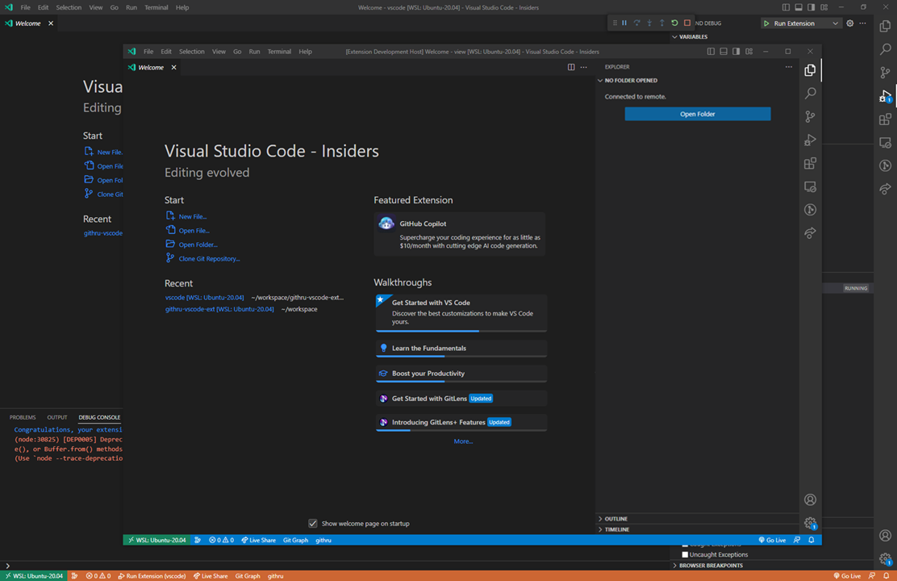
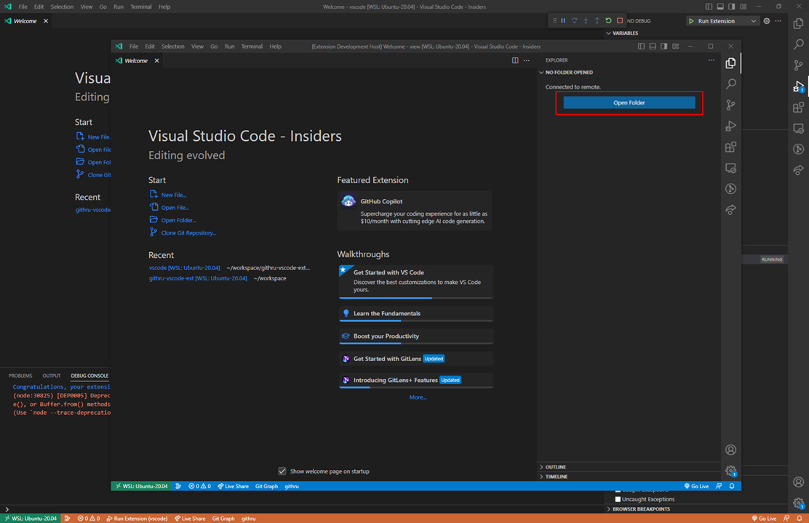
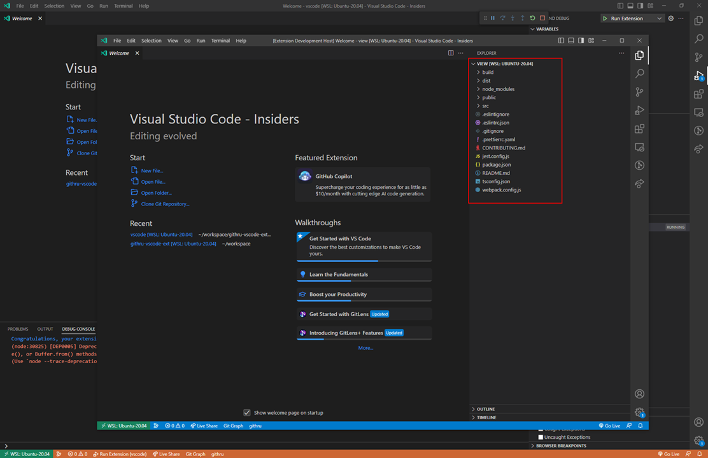
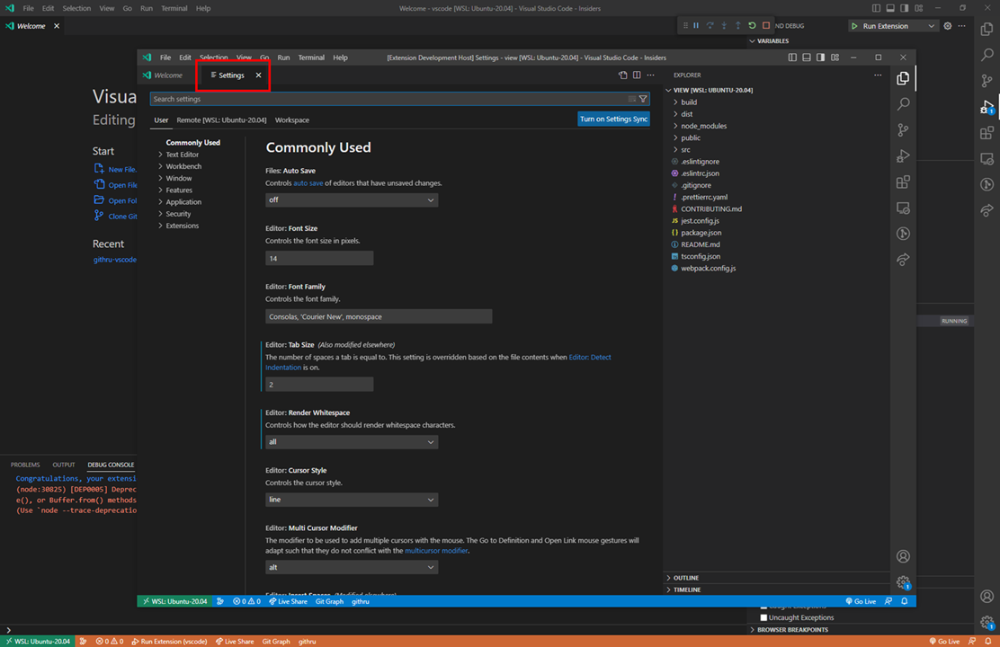
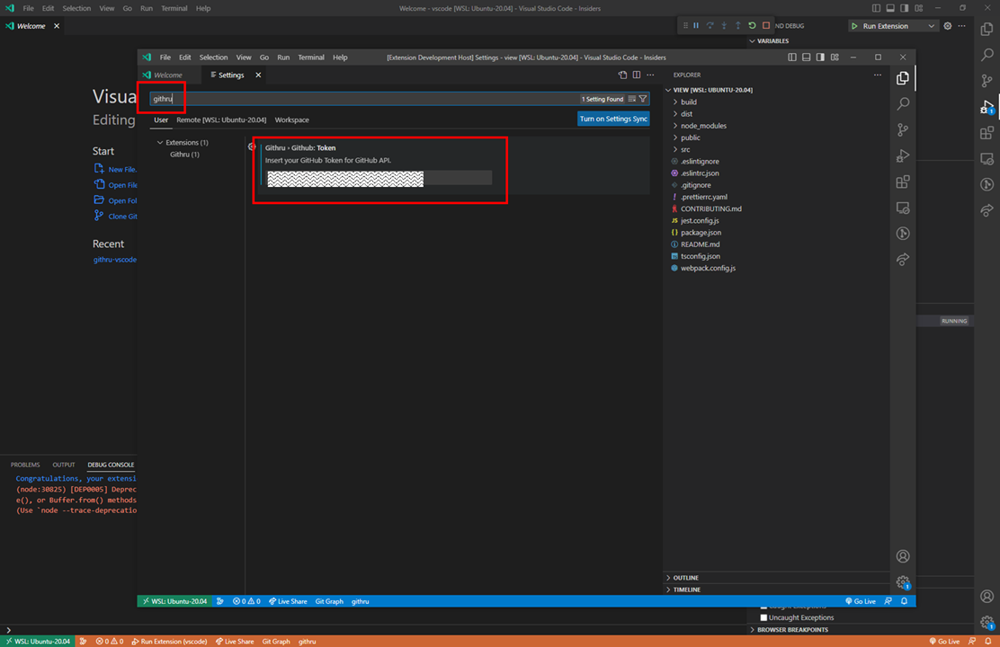
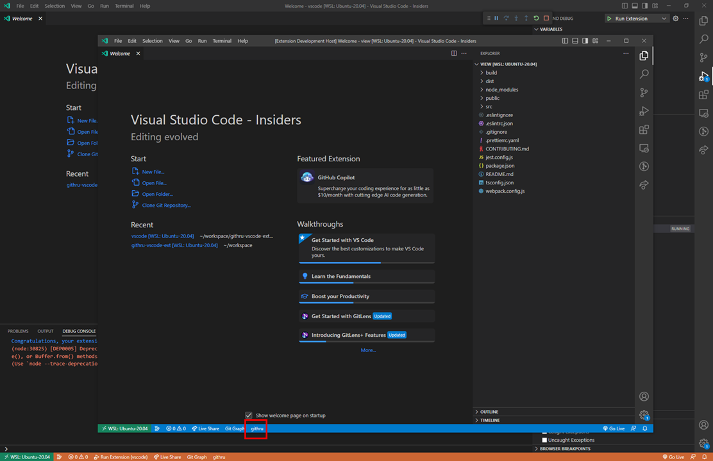
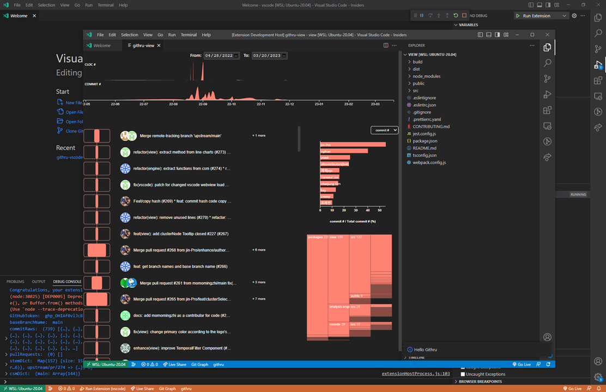

# Getting Started (KO)

로컬 개발환경을 위한 프로젝트 실행방법을 설명합니다.


## install dependencies

```
cd <프로젝트 루트>
npm install
```


## build

```
npm run build:all
```

view → engine → vscode 순서대로 빌드를 시작합니다.


## run on debug mode

1. vscode IDE 를 통해 `<프로젝트 루트>/packages/vscode` 를 불러옵니다.
    

2. `<프로젝트 루트>/packages/vscode` 를 실행한 vscode IDE 내에서 `F5` 버튼을 통해 debug mode 로 진입합니다.
    

3. debug mode 로 실행된 vscode(githru의 vscode패키지) 에서 다른 git 기반 프로젝트를 불러옵니다.
  (주의 : debug mode 로 실행된 vscode 로 불러올 경로가 다른 vscode 에서 이미 열려있는 경로라면, 제대로 동작하지 않습니다.)
  (ex. `<프로젝트 루트>/packages/view/tsconfig.json`)
    
    

4. debug mode 로 실행된 vscode(githru의 vscode패키지) 의 settings 에 진입합니다. (단축키 : `ctrl + ,`)
    

5. settings 화면에서 "githru" 검색을 통해 githru 설정화면에 진입한 다음,
  githru engine 에서 사용할 github access token 를 입력합니다.
  (토큰 발급 참고자료 : https://docs.github.com/ko/authentication/keeping-your-account-and-data-secure/creating-a-personal-access-token)
    

6. debug mode 로 실행된 vscode(githru의 vscode패키지) 의 하단 상태표시줄에 "githru" 텍스트 버튼을 통해 githru 화면에 진입합니다.
    
    


